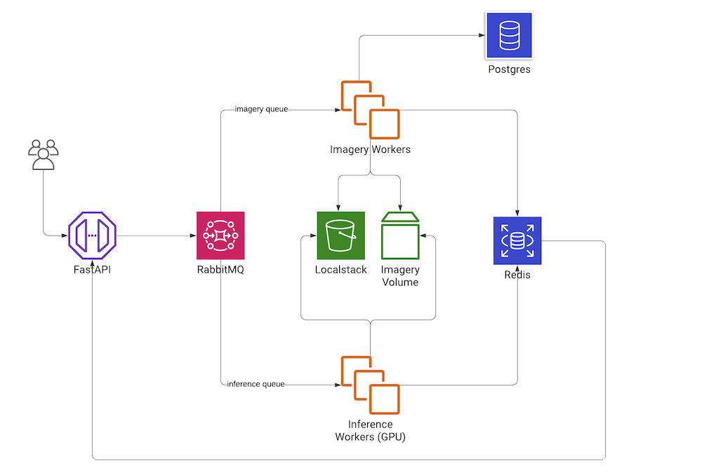

## Overview

Create a scalable system to ingest image data, then run queries on this dataset to extract a portion, transform and apply ML models. You should test on the [fashion dataset](https://www.kaggle.com/paramaggarwal/fashion-product-images-small), but the system should in theory be designed in a way it could efficiently work with a much larger dataset.

### Timeline

You shouldn't spend **more than 8 hours** on this, so it will be intentionally sparse. This helps us understand your ability to prioritize what is important.

Please provide your solution **within 72 hours** of reading this, or on the time line we agree on email.

### Submission

Create a Pull Request for this repo when ready with your result, which we'll use to ask questions and review with you.

## Expectations

Treat this as a real-world project that would be used and modified by others in the future. There is some flexibility in the requirements, bonus tasks etc - please be creative, but also judicious with a concise solution. Make sure that we are able to validate your solution. It's good to double check this by cloning your solution and trying to run a clean installation yourself before submitting.

Ask as many questions as you want to ensure that we're on the same page in terms of what is required.

### Focus On

- Code quality
- Clear Documentation

## Project instructions

### Prerequesites

This project needs docker >= 20 and docker-compose >= 1.29. Installation:

```
curl -fsSL https://download.docker.com/linux/ubuntu/gpg | sudo gpg --dearmor -o /usr/share/keyrings/docker-archive-keyring.gpg

echo "deb [arch=$(dpkg --print-architecture) signed-by=/usr/share/keyrings/docker-archive-keyring.gpg] https://download.docker.com/linux/ubuntu \
  $(lsb_release -cs) stable" | sudo tee /etc/apt/sources.list.d/docker.list > /dev/null

sudo apt-get update
sudo apt-get install -y docker-ce docker-ce-cli containerd.io
sudo groupadd docker
sudo gpasswd -a $USER docker
sudo service docker restart

pip install docker-compose
```

Log out and log back in so that your group membership is re-evaluated.

### Add dataset

Please, prepare the data: [Fashion Dataset](https://www.kaggle.com/paramaggarwal/fashion-product-images-small). Download the archive and extract it to `DATASET_PATH` from Makefile (or specify your own path).

### Build

Run this before you run any other make commands to ensure you have build the images.

```sh
make build
```

### Run

```sh
make up
```

After running this command you will see and URL for Jupyter notebook in the output. If not, you can run `docker-compose logs client` to find it out.

### Test

Before running tests remember to build the project.

Hint: take a look at the docker-compose to see how you could simplify the deveplment work usings tests to validate your code is working.

```sh
make test
```

### Finish

```sh
make down
```

### Architecture



## Tasks

Open the notebook in the url outputted by the `make up` command. In the notebook you will see three different tasks. We advice you to do them in the given order.

1. Implement functionality to upload images based on a sql query to S3
2. Add augmentation to the Step 1
3. Run model inference on query results from Step 1 or Step 2
4. Write couple of unit tests to show your testing skills


## Bonus Points

- Discuss, and/or implement a proof of concept how you would scale your solution to millions or billions of images in a short time frame (<1day, <1hour) assuming infinite resources
